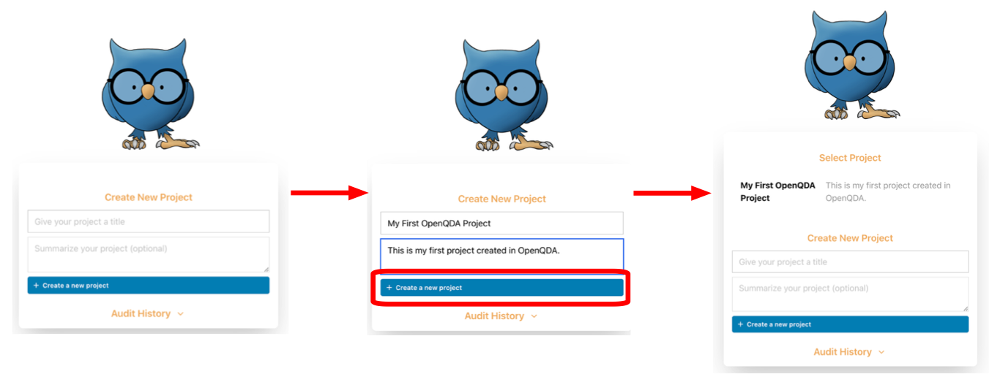
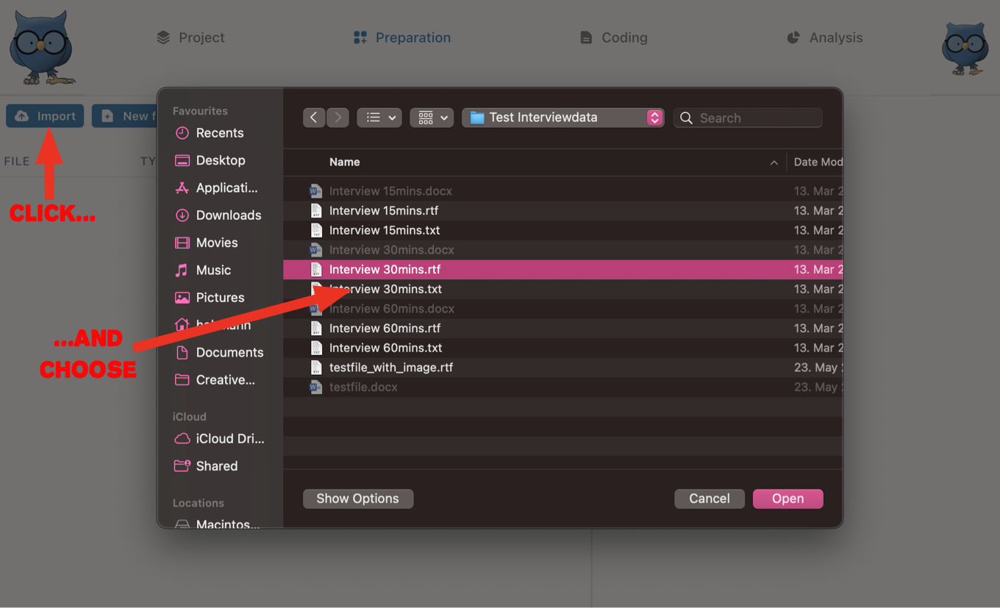

# Introduction to OpenQDA

Let's discover **OpenQDA in under 10 minutes**.

## Register a new account

Head over to [the OpenQDA website at openqda.org](https://openqda.org).

Click on the orange **Register** button.

Now fill out the register form with your name or pseudonym, your email and a secure password.
Then confirm that you are not a robot (to your knowledge) and click the **Register** button.

> :bulb: **Tip:** While currently it is only required that your password consists of a minimum of eight characters, we recommend using a mix of letters, numbers and special characters.

> :postbox: A verification email should have been sent to the email address you provided - please open it and click the link to verify your email address and complete the registration process.

Now that you are verified, you can log into OpenQDA with your mail address and password and start using the software by either editing your profile or creating a new project for data analysis.

## Create your first project

Your work in OpenQDA is organized in projects.

Fill out the project form and give your first project a nice name (and optionally write a description, for example your research question).
Then click the **Create a new project** button.
Your new project is created, and you go to the project tab. If you want to go back and create more projects or switch between projects, click on Qudi, the little blue owl, in the left corner (this will change in the next version of OpenQDA, because it is not self-evident).

## Manage your project 

OpenQDA is organized in four different tabs oriented on the workflow of a typical QDA project. Those tabs are "Project", "Preparation", "Coding" and "Analysis", and you find them at the top of your screen. When you create a new project, you will find yourself at first in the "Project" tab of OpenQDA. Here, in the **Overview** you can update the project name or project description of your project and even delete your project.

In the sub tab **Collaboration** you can set up your project to work with others. We skip this part for now.

In the sub tab **Codebook** you can manage different codebooks, share, reuse and import codebooks from other people. To create an empty codebook for your project, simply enter a name and optionally a description and click the blue "Create" button.

> :exclamation: **Please note:** OpenQDA gives you the option to share your codebooks with other users of the platform. To do so, click the little checkbox next to "Shared with public" when creating your codebook. It will then appear in the **Public Codebooks** section and others can import a copy of it into their projects. This will not have any effect on the codebook in *your* project.

In the sub tab **History** you see a full log of all actions within the project.

> :bulb: **Tip:** BTW, if you want to edit your profile picture, click on the profile picture in the upper right corner of the screen (at the moment it should just be your initials) and select "Profile". Now you can select a new photo for your profile by uploading it from your hard drive. You can also change your name or password..

## Upload and prepare a text file

Great work on creating your first project! But that project is still empty. To change that, let's upload our first text file and prepare it for coding. To do so, switch to the "Preparation" tab. That's the second tab from the left on top of your screen.

> :exclamation: **Please note** At the moment, OpenQDA only supports *.RTF and *.TXT files. Other common file formats, like *.DOC, *.DOCX or *.PDF files might be supported at a later date. OpenQDA has a plug-in architecture: We, you, or other people in the community are able create import plug-ins for other file formats.

Now, to upload an existing file, click the **Import** button to select a *.TXT or *.RTF file. Click on the title of the document to see the contents of the file in the editor in the right pane. Now you can edit the document and prepare it for coding, if necessary.

The editor works just like any word processor you know. Here you can add or delete text and also format the text according to your needs. Don't forget to click the **Save** button above the text to make your changes permanent. This way you can even create documents directly in OpenQDA. Just click the **New File** butten next to the **Import** button on the top left. You can then type or paste your text contents (for example from a *.PDF file) into the newly created document. Again, don't forget to save your work.
If you click on the three little dots next to a file name, you can also rename the document or delete it from your project.

When you are done editing your file, you can press the **Lock and Code** button to lock the file and start coding.

> :exclamation: **Please note** Please be aware that once you started coding a document, you can not unlock it anymore to make further edits. Once coding started, editing ends.

## Coding the text

Now you are in the **Coding** tab section.
In the left pane there is your text (you can switch between texts with the blue menu button).
On the right you see your codes pane. Right now you need to activate a codebook to start coding.
If you do not have any codes in your code book, let's create one by clicking on **Add Code**.
A new code category appears. You can edit it's name by double clicking on the text. 
You can also create a note (click on the pen icon).
To create subcodes or move your codes, click on the mini-menu button of the code.
You can code text in 3 ways:
- make a text selection and use right mouse click / contextual menu click and select a code
- drag the text selection to the code
- drag the code to the text selection
All dragging only works on Macs and PCs, not on smartphones or tablets (we are working on it).

## Analysis

To do your analysis, go to the **Analysis** tab section.

## What next?

TBD
