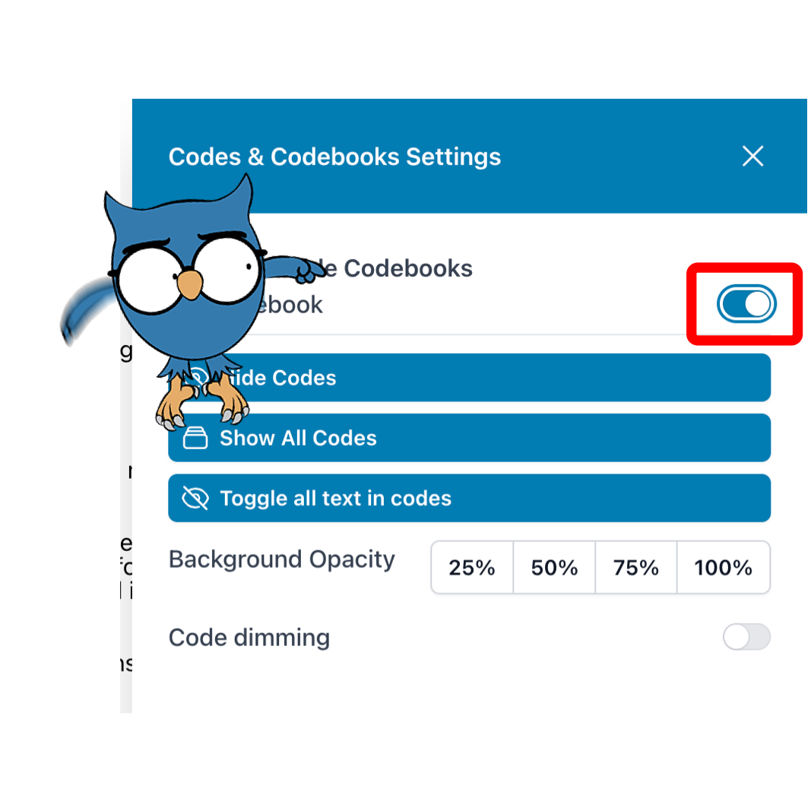
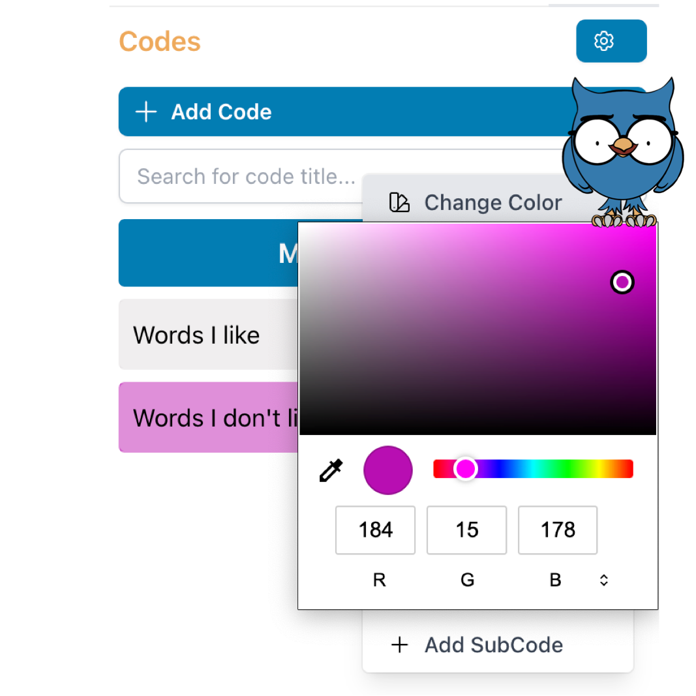

# Coding the text

By clicking the **Lock and Code** button at the document preparation or simply by clicking the **Coding** tab (the third one from the left) on the top of your screen you get to the **Coding** section.

On the left hand side you see your document (you can switch between locked documents with the blue menu button).
On the right hand side is your codebook (or code system/code tree/code collection/...). To start coding, you need to activate at least one codebook. You can do that by clicking the little cog wheel and then select one of the available codebooks.

Since we only created one codebook when we created the project, we just choose that one.

If you do not have any codes in your code book, you can create them by clicking on **+ Add Code**. A new code with a radomly created name and color appears. You can edit its name by double clicking on the text and you can change the color via the menu that opens by clicking the three vertical dots on the right side of each code. The color change is the first entry.

You can also find the options to create subcodes or move your codes around in that same menu.

If you would like to create a note (or memo) for a code, simply click the little notepad icon next to the name of the code. This opens a little yellow "Post It" note for your text.

There are three different ways to code text in OpenQDA:
- making a text selection by highlighting it with the pressed left mouse button and use **right mouse click** to open a contextual menu and then click on the desired a code for the highlighted text
- making a text selection by highlighting it with the pressed left mouse button and then clicking and holding the selection with the left mouse button and **dragging it** to onto the desired code on the right
- making a text selection by highlighting it with the pressed left mouse button and then **dragging the desired code** from the coding system onto the selected text

> :bulb: **Tip:** You don't actually have to "aim" for your text selection, it's enough to drag the code anywhere in your document.

> :exclamation: **Please note** Please be aware that all options involving dragging only work on Macs and PCs, not on smartphones or tablets (we are working on it).
