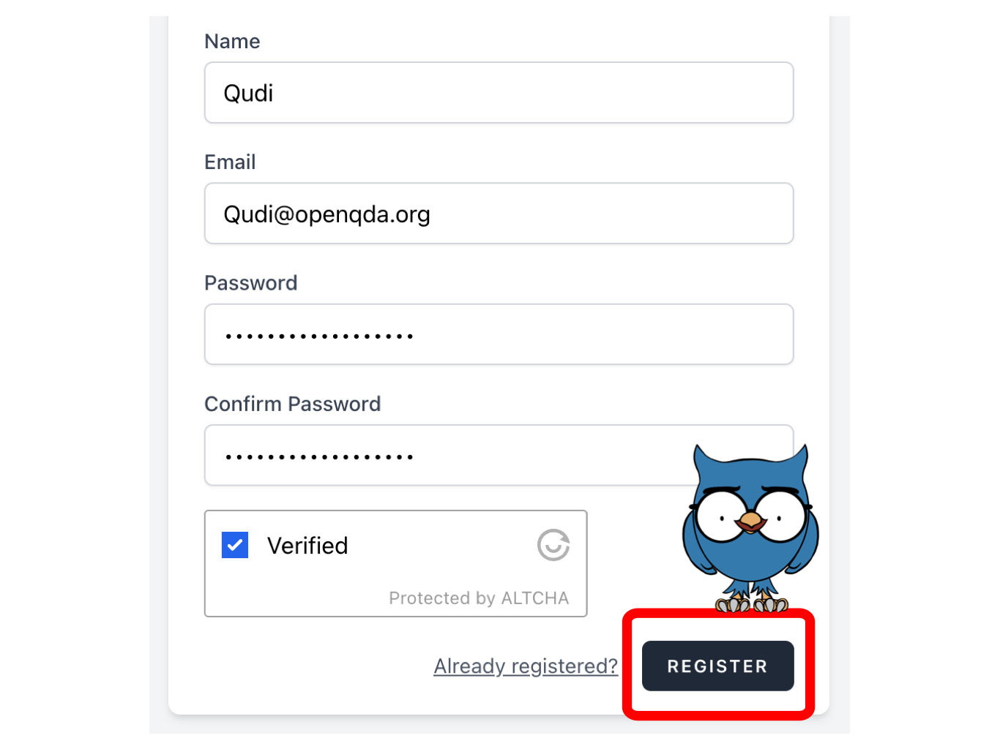

# Register a new account

Head over to [the OpenQDA website at openqda.org](https://openqda.org).

Click on the orange **Register** button.

Now fill out the register form with your name or pseudonym, your email and a secure password. Make sure there is no typo in your email address. Then confirm that you are not a robot (to your knowledge) and click the **Register** button.

> :bulb: **Tip:** While currently it is only required that your password consists of a minimum of eight characters, we recommend using a mix of letters, numbers and special characters.

> :postbox: A verification email should have been sent to the email address you provided - please open it and click the link to verify your email address and complete the registration process.

Now that you are verified, you can log into OpenQDA with your mail address and password and start using the software by either editing your profile or creating a new project for data analysis.
