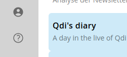
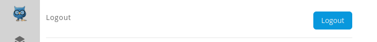
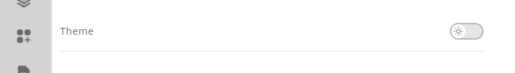
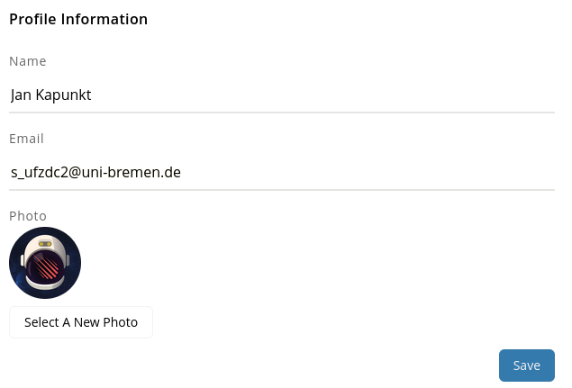
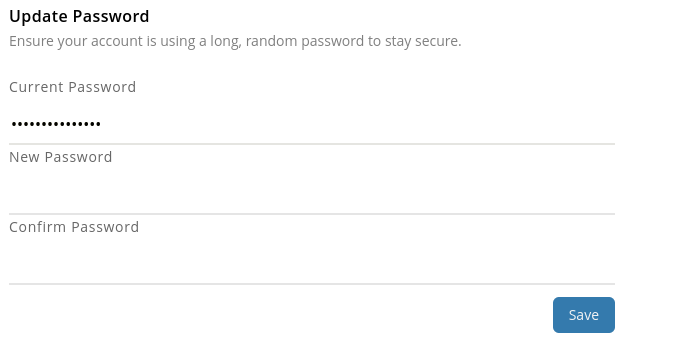
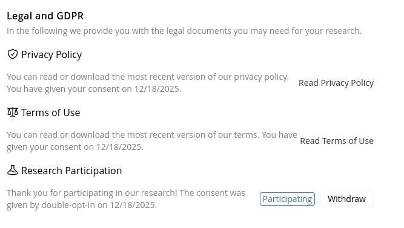
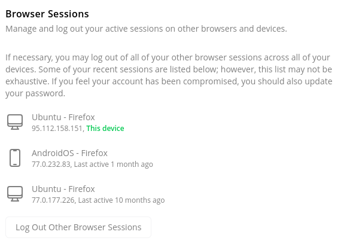
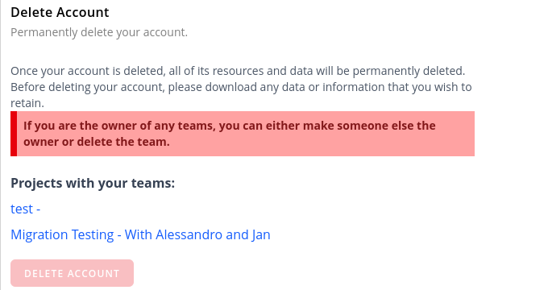

# User Profile

The user profile page can be accessed by clicking on the user icon, located on the navigation bar to the left.

## Log out
On this page you can explicitly log out of your account by clicking the "Log out" button at the top of the page.

## Theme switching
You can switch between light and dark themes by clicking the theme toggle button.
Please note, that dark mode is still experimental and some parts of the UI might not be fully optimized for dark mode yet.

## Change your name, email address and user picture
You can change your name, email address and user picture by editing the respective fields and clicking the "Save" 
button.

> :bulb: **Tip:** After changing your email address, you will receive a verification email to confirm the new address.
> Please check your spam/junk folders to make sure you received the email in time.
> You will not be able to do any action that requires email verification (e.g. password reset) until you verified the new email address.

## Change your password
You can change your password by entering your current password and the new password twice to confirm it.
If you forgot your current password, you can use the password reset feature on the login page.
We recommend using a password manager to generate and store secure passwords.

## Legal
You can access the terms of service and privacy policy by clicking the respective links.
Additionally, we show you the date when you last accepted the terms of service and privacy policy.

The legal section offers to optionally [participate in research](./research.md).

## Browser sessions
You can see all your active browser sessions and log out by clicking the "Log out other browser 
sessions" button next to each session. You will remain logged in on the current browser session.

## Delete your account

> :alert: Danger zone! Deleting your account is permanent and will remove all your data from our servers.
> This action cannot be undone. We cannot recover your account or any associated data once it has been deleted.

You can delete your account by clicking the "Delete account" button at the bottom of the page.
The delete button is disabled as long as there are teams you are the owner of with active members.
In that case you will first have to [transfer ownership or delete the teams](projects/teams.md).

