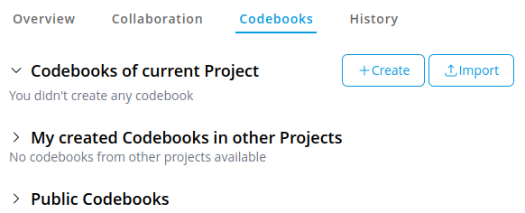
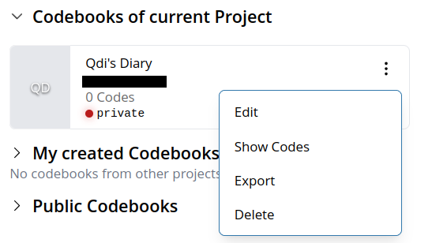
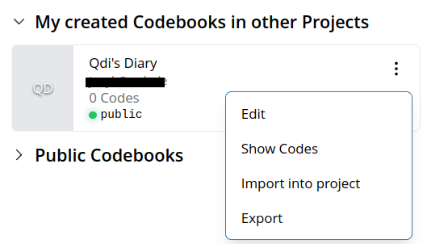
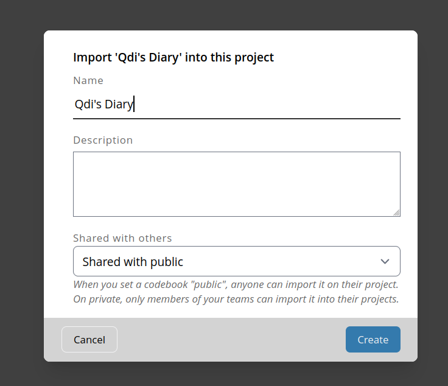
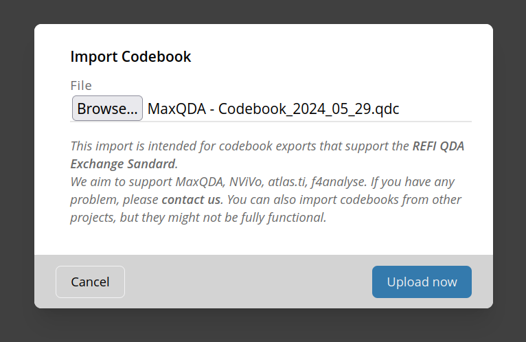
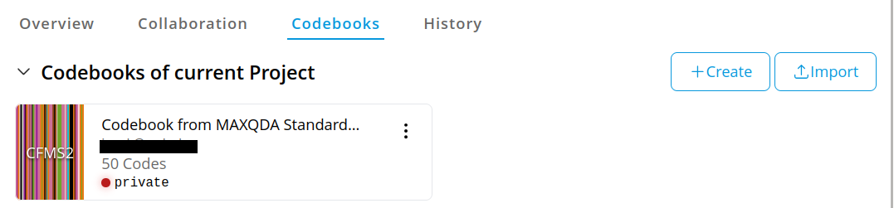
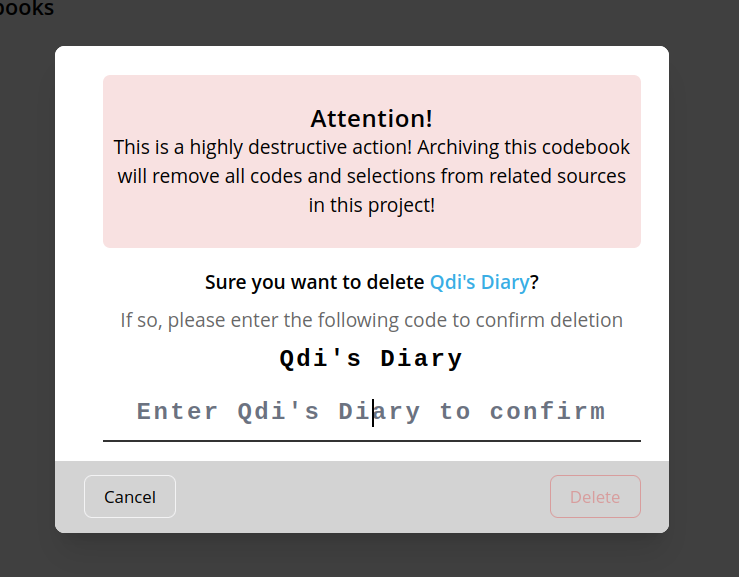

# Manage your Codebooks

Codebooks are a crucial part of QDA. In this view you can manage to create, update
or delete your codebooks. For the sake of reusability and interoperability you can also import and export
codebooks.

## Create a new codebook
Every project gets automatically associated with a default codebook.
If you haven't created one yet, you can do it either here or it will be created,
once you start coding your first source.

## Edit a codebook
In order to edit a codebook you need to locate it on the page an click on its menu button (three vertical dots).

There click on "Edit" to open the dialog and edit to your needs.

## Share your codebook
OpenQDA gives you the option to share your codebooks with other users on the platform.

To do so, either create or edit a codebook and select for the option "Shared with others" the entry "Shared with public".

It will then appear in the [Public Codebooks](#public-shared-codebooks) section, unless it's used in a current project
(because it then appears in "Codebooks of current Project").

Others can now import **a copy** of it into their projects.
Their import will not have any effect on the codebook in *your* project.

## Adding codes

> [!NOTE] For now, you can only add codes to a codebook when being in the [coding view](../workflow/coding.md).
> In the future we may provide the ability to add/sort codes for a codebook in this view, too.

## Import codebooks
You can import codebooks from various sources, either from within the OpenQDA platform or from external software,
such as other QDA Software (as long as it implements [REFI](../refi.md) compatible export) or exported from OpenQDA.

### From your other projects
Codebooks you create for a project can automatically be imported in other projects.
Note, they are copied. This means any changes to the codebook will not affect the original codebook.

In order to do so, open the section "My created Codebooks in other Projects" and search for the codebook
to import. Open the menu (three vertical dots) and select "Import into project".

It will open a dialog, allowing you to edit how the new imported codebook should be named, or if it should be shared
(whether this makes sense or not).

### Public shared codebooks

### Upload from file
In this example we import a codebook, exported by MaxQDA. For this, click the "Import" button
on the top-right of the view and follow the dialog to select the file from your local drive.

Click on "Upload now" and wait until the upload is processed. Depending on your codebook size an
structure, this may take a while. Please do not navigate away from the page until the upload
is complete.

Once uploaded, you should see the new uploaded codebook on the list "Codebooks of current Project".

## Export a codebook
In order to export a codebook (to a .qdc file) you need to open the menu clicking its menu button (three vertical dots)
and select "Export".

From there, follow the save dialog to save the generated .qdc file to your local drive.

## Delete a codebook
You can only delete codebooks of the current project.

> [!CAUTION]
> ⚠️ This action is highly destructive. All codes and selections for this project, 
> associated with the codebook will be lost. This action is final and permanent.
> Proceed with caution and make this circumstance clear within your team!

In order to delete a codebook you need to open the menu by clicking its menu button (three vertical dots)
and select "Delete". Then follow the dialog and enter the exact name of the codebook (case and whitespace sensitive)
to enable the red "Delete" button. Click that button to delete the codebook.

