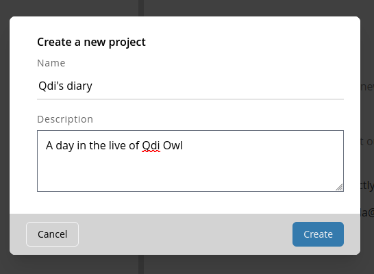

# Create your first project

Your work in OpenQDA is organized in projects.
They are used to associate your codebooks, sources and collaborations.

After logging in to OpenQDA you are redirected to the projects page.
Initially this page is empty.

In this state (no project selected) the sidebar on the left only
allows you to navigate between this page and your user profile page.

## Invoke the create form

Click on "New Project" to invoke the form and fill out the necessary information:

Your new project is created and automatically selected.
