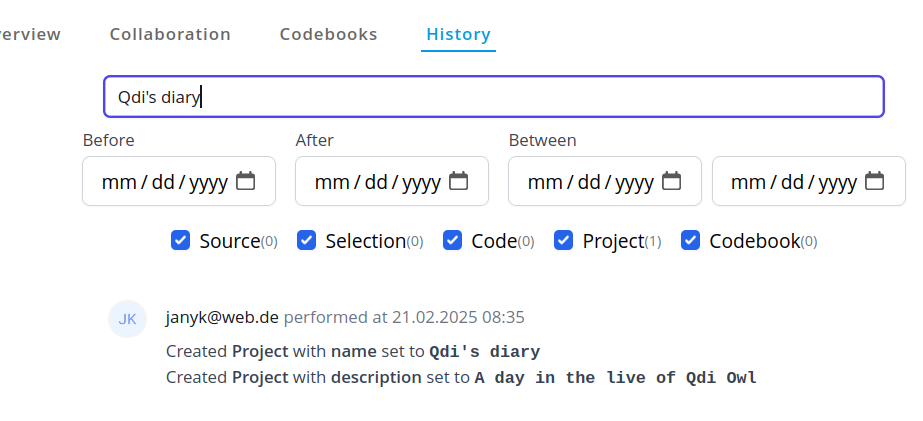

# History
The History view provides you a full log of all actions within the project.

> [!WARNING]
> Right now not all actions are added to the history. Our long term goal
> is to record every action to make your project fully auditable!

The list is ordered descending by date (newest entries at the top) and provide various filters
to review actions before, after or between certain time intervals.

Additionally, you can enter search terms to filter the list for specific actions and content.

