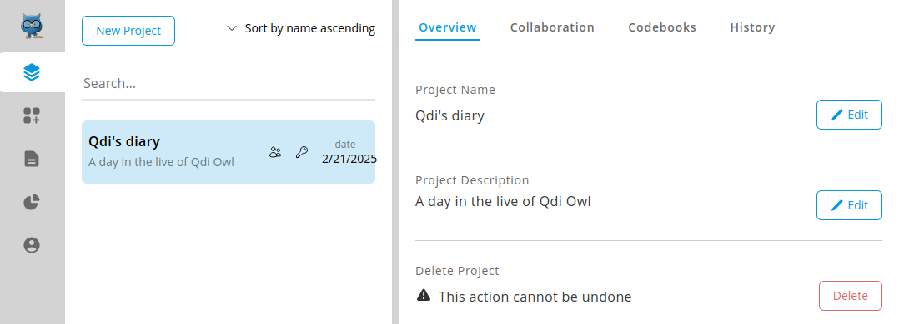

# Manage your projects
OpenQDA lets you organize your work in projects.
This pages intends to present you the main project management features.

## Project page and entries
Your projects are listed on the projects page, which you can reach by clicking
on the projects icon on the [navigation bar](../ui.md).

Every [created project](./create.md) is listed on the left panel
and contains the project name, the date of last update and
some icons:

The **key icon** indicates projects created by yourself. 
If you were added to a project by another member then this icon
will not be displayed.

This **users-icon** indicates that a project has a [teams](./teams.md).

The **documents icon** shows the number of [Sources](../workflow/preparation/overview.md#sources)
you (or your team members) have already added to this project.

## Select a project
After you successfully signed in to OpenQDA you may find 
there is no current project selected:

In this case you will not be able to navigate to preparation, coding or analysis and
you will have to select an existing project [or create a new one](./create.md).

Click on a project entry to select it as the current project, which in turn
opens the project management views in the right panel.

## Overview
This is the default view for a selected project.
Here you can edit your project information,
view and select the added sources, or delete the entire project, including all it's data.

Your project is organized in different views:
- [Overviev](#overview)
- [Collaboration](./teams.md)
- [Codebooks](./codebooks.md)
- [History](./history.md)

Each comes with own features, functionality and complexity,
which we want to present you in the following sections.

## Delete a project

> [!CAUTION]
> ⚠️ Deleting a project is **final and permanent**. There is no way to recover a deleted project,
> not by yourself (self-hosted), nor by the admins (managed).

If you intend to delete your project then click on "Delete". A prompt appears, asking you to type the project's name
exactly as given (case- and whitespace sensitive).

The delete button will only become clickable, when the project name is entered as required:

Now you can click on "Delete". The project and all its data is deleted, and you will
be redirected to projects overview, where no project is selected.

