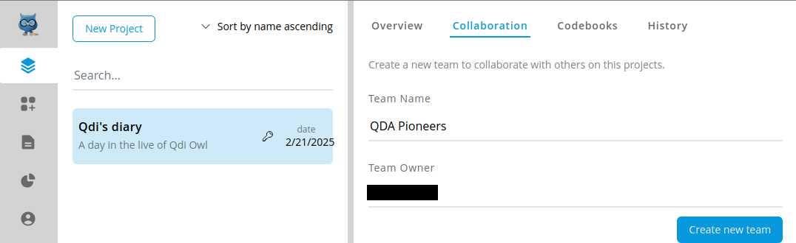
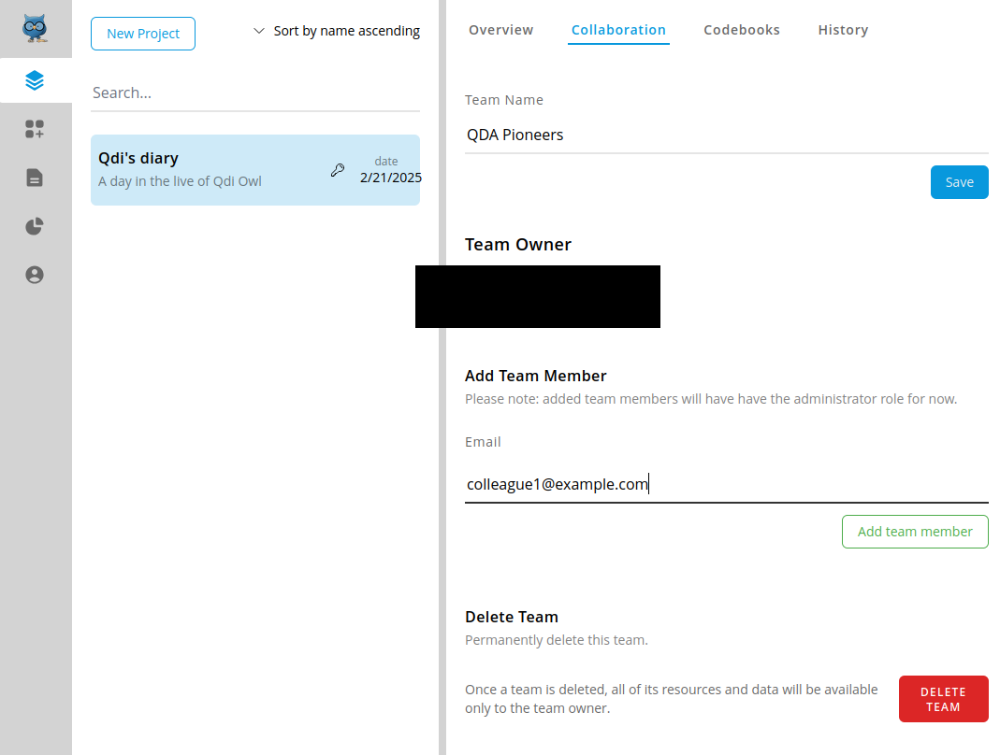
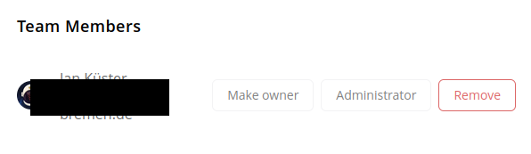
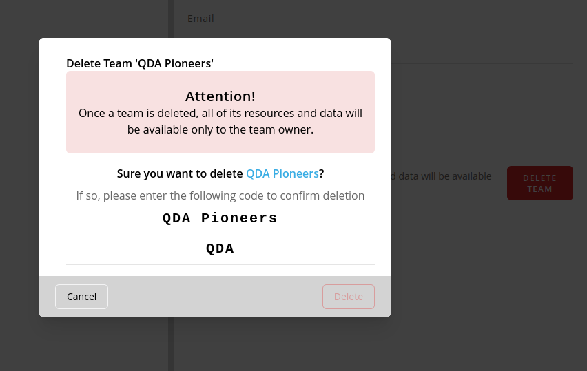

# Collaboration and Teams
Here, you can set up your project to work with others and manage those teams.

## Create new team
Before you can invite others, you will have to create a new team by providing a team name.

Your account will automatically be associated as owner.
Click on "Create new Team" to complete this step.

## Add team members
In order to add new team members you must provide their email address associated
with their OpenQDA account and click on "Add team member".

A confirmation message will appear, if the email address was found
and the team member was successfully added.
Additionally, the added team member receives a notification email about being added to the team. 

> [!CAUTION]
> ⚠️ For now all team members have the same permission on the project,
> including destructive actions. Proceed with caution and make this circumstance clear within your team!
> Future versions of OpenQDA may receive a fine-granular permissions system.

## Manage team members
Currently, you can make a new team member to become the new project and team owner or remove the team member.
Removing a team member **does not** delete the data they created or added, such as sources, codes or selections.

Making a team member the new owner might be necessary if you wish to delete your own account but
want your team to continue to work on the project.

## Deleting the team
Deleting the team will remove all non-owners from the project, causing
them no not access the project data anymore.
Be aware of this fact, when making another person owner of the project.

Click on "Delete Team" to invoke the deletion prompt and enter the exact team name
(case and white-space sensitive) in order to enable the "Delete" button.

