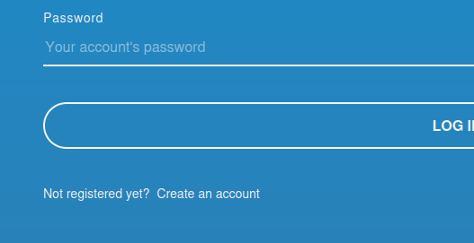
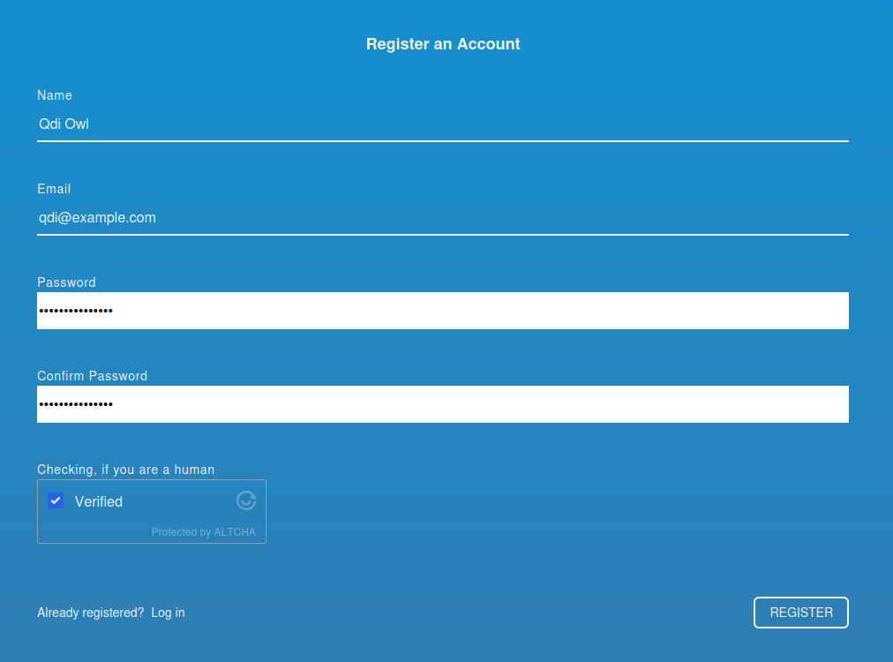

# Register a new account

Head over to [the OpenQDA website at openqda.org](https://openqda.org).
You will see the default login screen. Below the login form you will have the option
to create an account by clicking on "Create an account":

## Fill out the registration form
Now fill out the register form with your name or pseudonym, your email and a secure password.
You will have to confirm that you read and accept the terms of service and privacy policy.
Optionally, you can [participate in research](./research.md) by accepting the research consent.
Then confirm that you are not a robot (to your knowledge) and click the **Register** button.

> :bulb: **Tip:** While currently it is only required that your password consists of a minimum of eight characters, we recommend using a mix of letters, numbers and special characters.

You might have noticed the "Checking if you are a human" section and wonder whether this
is using a third-party tool with privacy implications.
We are not sending data to third parties and the tool (https://altcha.org) is a self-hosted,
privacy aware alternative to commercial tools.

## Verify your account

A verification email should have been sent to the email address you provided - please open it and click the link to 
verify your email address and complete the registration process.
Please also check the spam/junk folders to make sure you received the email in time.

Now that you are verified, you can log into OpenQDA with your mail address and password and start using the software by
either editing your profile or creating a new project for data analysis.
