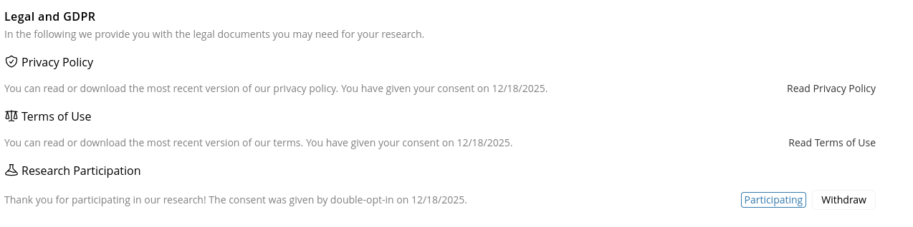

# Participating in Research

You might have noticed, that there is now the option to participate in our research when using OpenQDA
at https://openqda.org. This feature is crucial to use to help us improve OpenQDA and CAQDAS in general.

## TL;DR
- Research consent is optional
- Consenting results in a stored flag in our database only
- We use a triple-opt-in (double-opt-in plus we inform you when there is an actual study ongoing)
- You can withdraw your consent at any time
- We will not engage in any data collection without your explicit consent
- Data collected will depend on the actual research study
- Data is stored and processed according to our [privacy policy](https://openqda.org/privacy) at the University of 
  Bremen's datacenter

## What is this about?
We are conducting research on how people use qualitative data analysis software like OpenQDA.
This research will help us to better understand the needs of our users and to improve OpenQDA in the future.
To be able to conduct this research, we need your consent to collect certain data about your usage of OpenQDA
and possibly about your background (e.g. profession, experience with QDA software, etc.).

## What data will be collected?
For now, we will only store a flag in our database, indicating you are willing to participate in research.
When there is a research study ongoing, we will contact you with more information about the study.
This might be an invitation to a survey, an interview or a usability test.
We will only collect data that is necessary for the research study and will inform you about the data collection
in detail before we start collecting any data.

## How to participate?
You can opt in to participate in research during the [registration process](./registration.md) or later in your 
[profile settings](./profile.md).
We will then email you with an activation link that has to be clicked to confirm your participation.

If you can't click the link right away, don't worry - the link will be valid for 14 days.
If the browser doesn't open the link directly, you can also copy and paste it into your browser's address bar.
You can see your current participation status in your profile settings.

## Withdrawing your consent
You can withdraw your consent at any time by going to your [profile settings](./profile.md) and 
deactivating your participation using the `withdraw` button.

This will immediately stop any further data collection and remove you from any ongoing research studies.
If you have already participated in a study, we will keep the data you provided for analysis, unless you explicitly
request us to delete it, which you can do by contacting us via [openqda@uni-bremen.de](mailto:openqda@uni-bremen.de).
