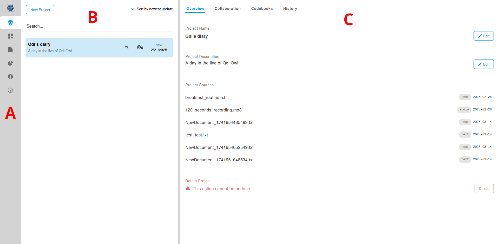
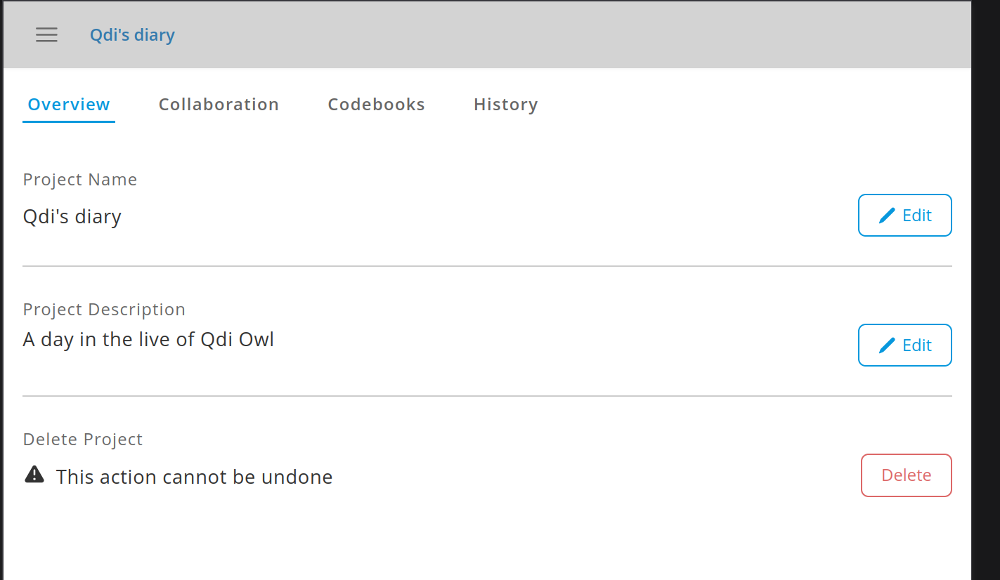
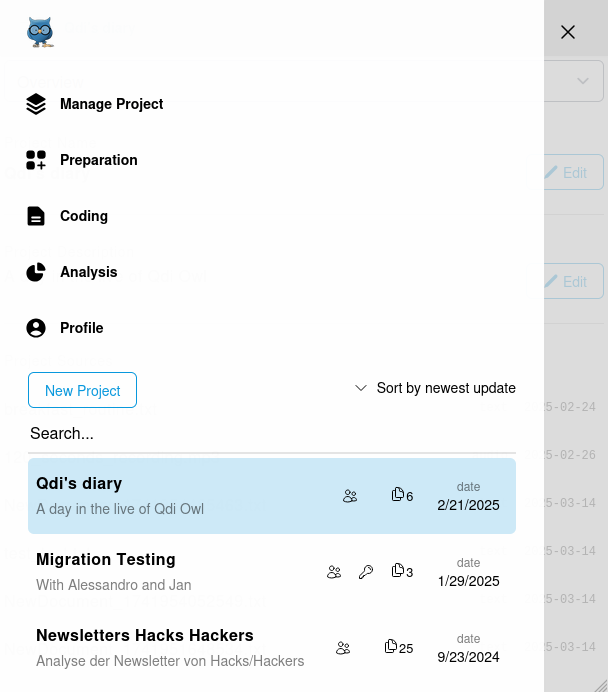

# Understanding the User Interface
OpenQDA comes with a fixed split-view UI (user interface), divided into three panels:

- Navigation (A)
- Left Panel (B)
- Right Panel (C)

OpenQDA is optimized and intended for use on desktop or laptop devices.
However, the UI is responsive to the screen size and will resize accordingly.

On mobile and small screens, the navigation and the left panel will automatically "disappear" from the default
view, leaving the right panel as the main view to the user.

To show the navigation and left panel, activate the mobile menu (top left, three lines)
to open or close them.

