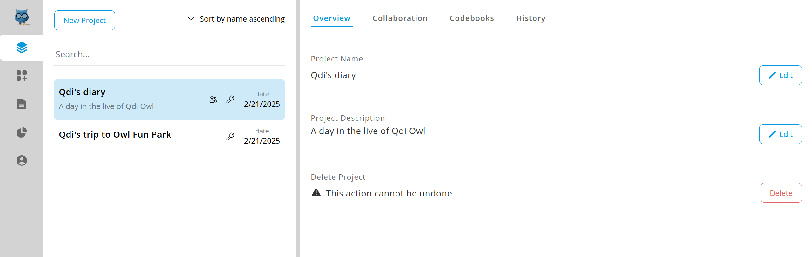
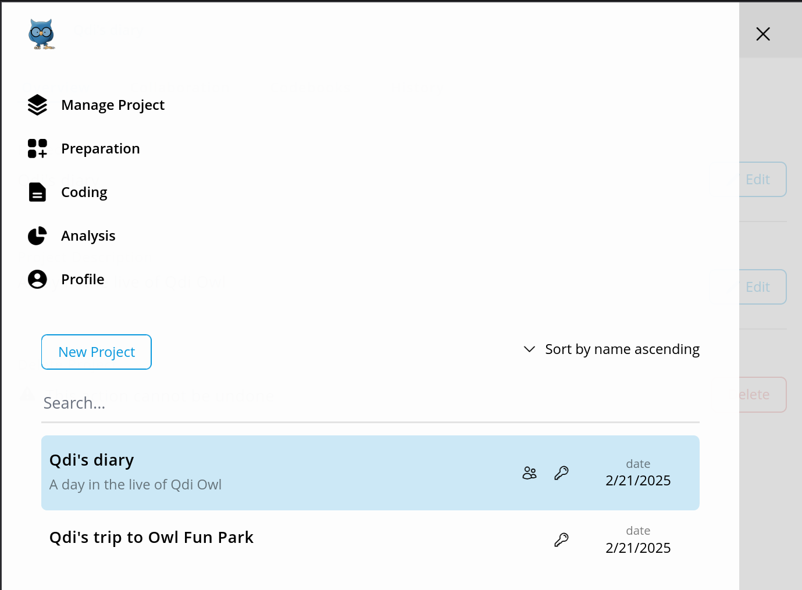

# Understanding the User Interface
OpenQDA comes with a fixed split-view UI (user interface), divided into three panels:

- Navigation (A)
- Left Panel (B)
- Right Panel (C)

OpenQAD is optimized and intended for use on the Desktop or Laptops. 
However, the UI is responsive to the screen size and will resize accordingly.

On mobile screens and small scale screens the navigation and the left panel will automatically "disappear" from the default
view, leaving the right panel as the main view to the user.

In order to show navigation and left panel, you need to activate the mobile menu (top left, three stripes),
in order to open / close them. 

