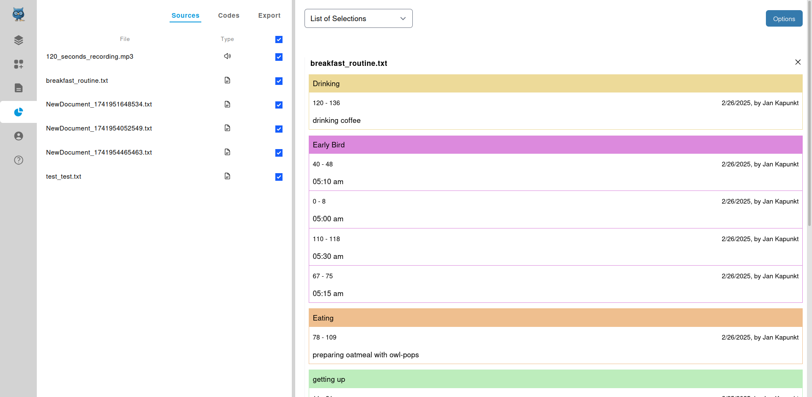
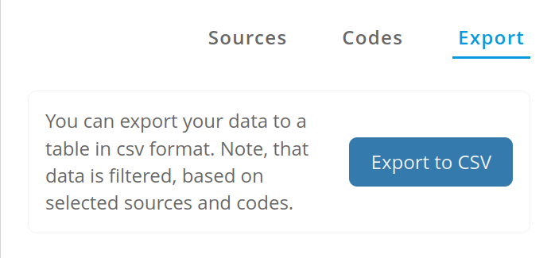
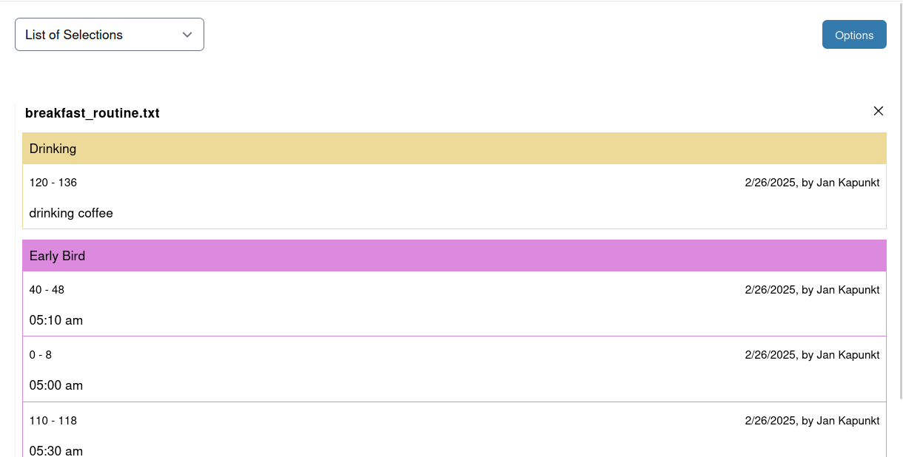
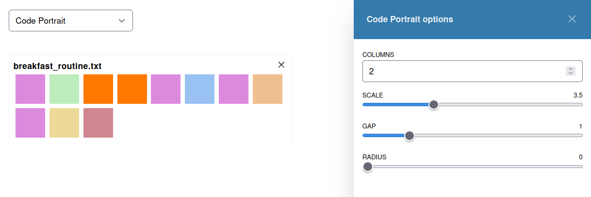
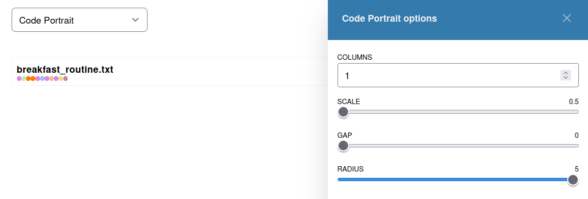
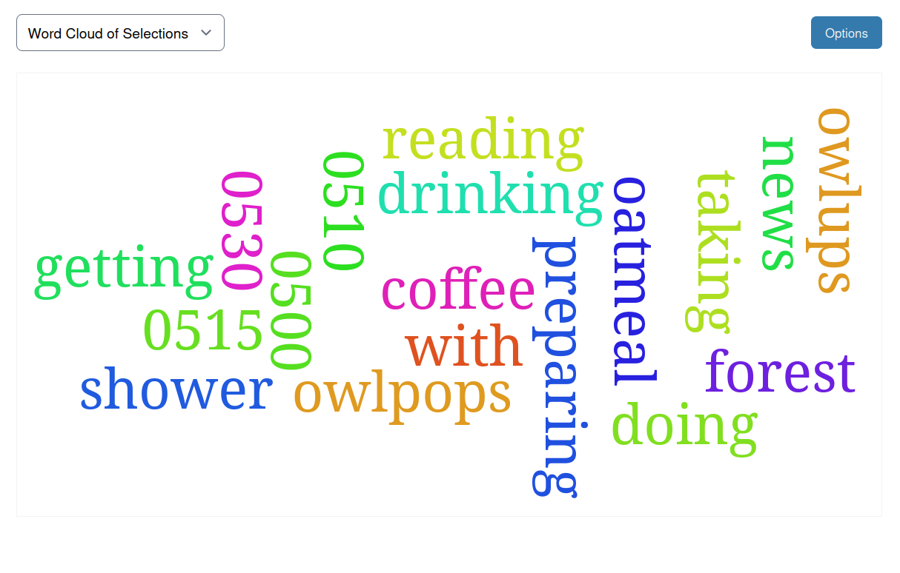
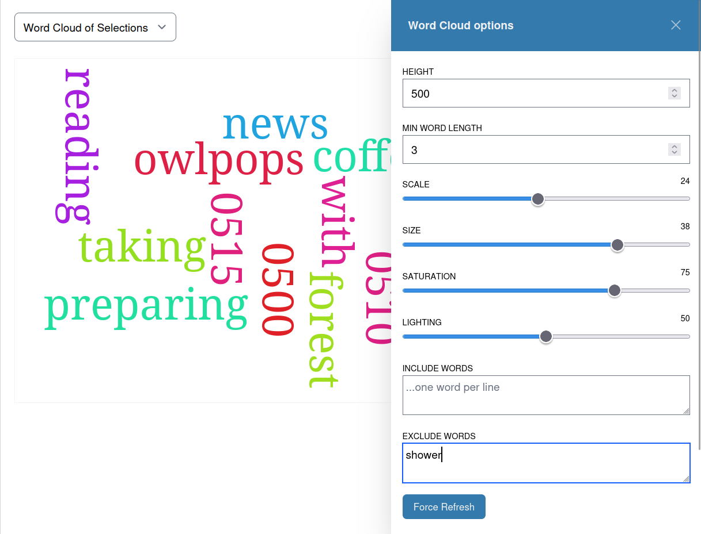
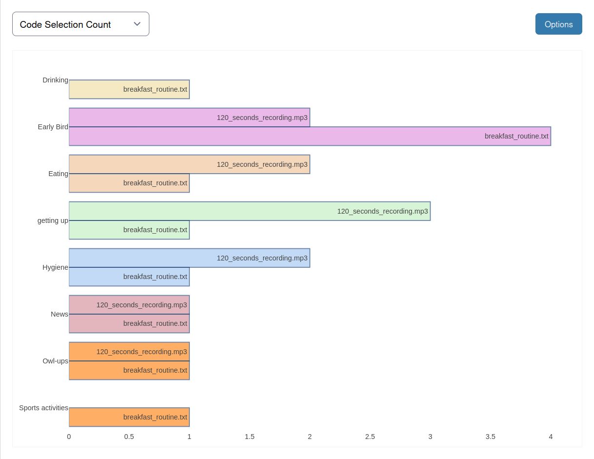
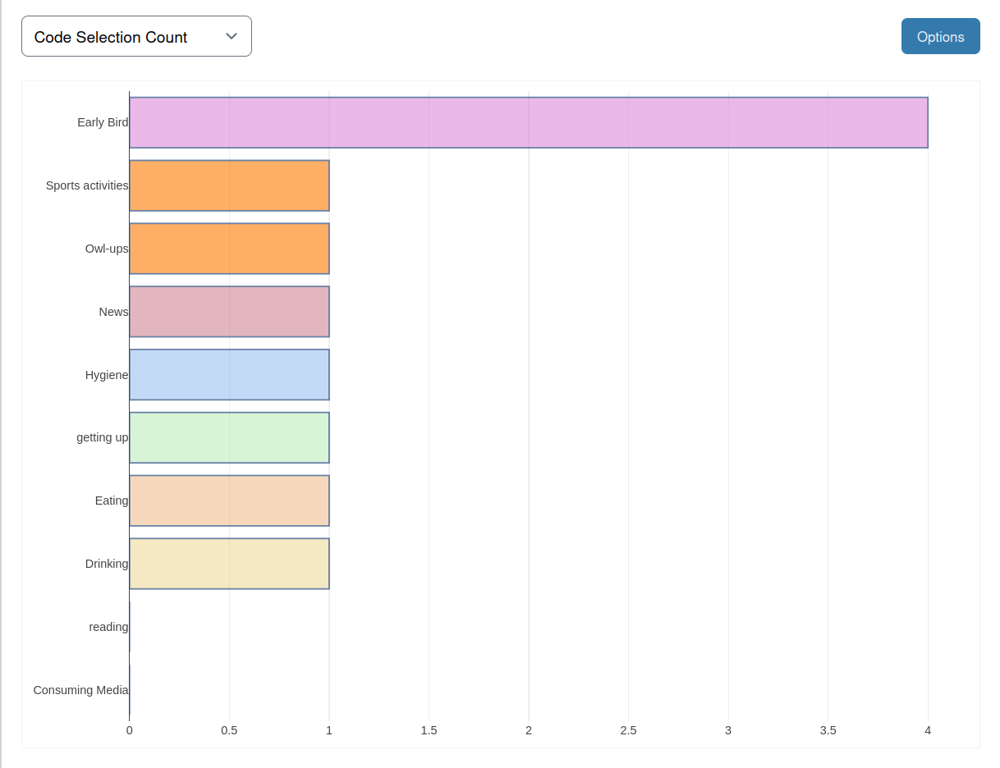

# Analysis

> [!NOTE]
> For now our analysis only provides visualizations.
> A near future goal is to also provide an interface
> for computational analysis plugins and workflows!

The analysis page is structured in the source/code selection, as well as export
(left panel), and the analysis tools (right panel).

In the right panel you can define which sources and codes
to include or exclude for your analysis.
This part is reactive, meaning any change of inclusion or
exclusion will trigger the analysis to re-run.

## Export your raw data
> [!WARNING]
> For now, the data included in the export is reflecting your
> selections of sources and codes.
> If you deselect any source or code then they will not be
> part of the exported data.

In order to export your data, select/deselect the desired sources and codes
and then click on the "Export" tab in the left panel.

Then select the desired export format in order to run the export.

> [!NOTE]
> For now, we only support CSV export.
> In the future we will support more options and formats.
> [You can help to add this feature by contributing to OpenQDA](https://github.com/openqda/openqda)

## Visualize your data
The right panel offers you a list of visualizations that allow for different displays
of your data. 

Each visualization may provide its own options, allowing you to modify certain
parameters that reactively update the visualization.

### List of Selections

The default visualization is a simple list of your selections for included sources and codes.

You can switch to a different visualization by clicking on the select menu in the right panel's
upper left corner and selecting the desired visualization.

### Code Portrait

The code portrait renders the all occurrences of selections of a given code in 
all included documents in their ascending order of their starting point.

Depending on the amount of sources and selections you might want to
play with the options in order to align their size and shape.

### Word Cloud

The word cloud renders all occurrences of words, covered by your selections.
The size of a word is thereby influenced by general options parameters and
the number of occurrences in a selection.

Besides that you manage filter lists for certain words, modifying your
word cloud towards a highly customized output.

Note that you should take a record (we will do that in future releases for you)
what parameters led to your cloud in order to make your publication more transparent!

### Code Selection Count

This provides a bar chart for counting code occurrences across all sources.
You can manage multiple parameters for layout and sorting.

**Counting by Source**
This provides a multi-bar chart that shows the code occurrences
aligned by the sources:

**Counting by Code**
This does not display sources but only the codes and their count
across all sources:

