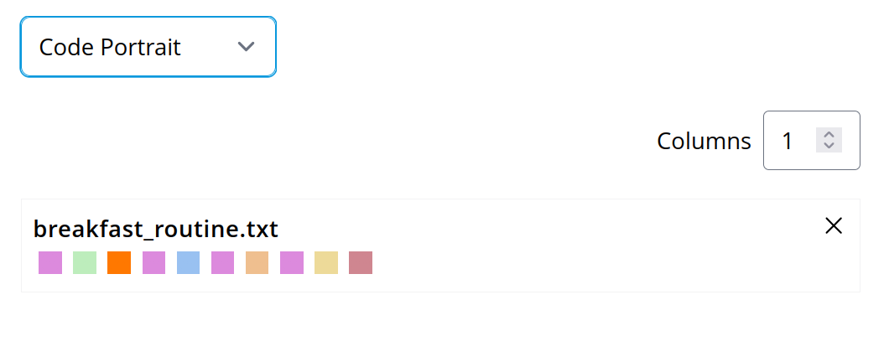

# Analysis

> [!NOTE]
> For now our analysis only provides visualizations.
> A near future goal is to also provide an interface
> for computational analysis plugins and workflows!

The analysis page is structured in the source/code selection, as well as export
(left panel), and the analysis tools (right panel).

In the right panel you can define which sources and codes
to include or exclude for your analysis.
This part is reactive, meaning any change of inclusion or
exclusion will trigger the analysis to re-run.

## Export your raw data
> [!NOTE]
> For now, the data included in the export is reflecting your
> selections of sources and codes.
> If you deselect any source or code then they will not be
> part of the exported data.

In order to export your data, select/deselect the desired sources and codes
and then click on the "Export" tab in the left panel.

Then select the desired export format in order to run the export.

> [!NOTE]
> For now, we only support CSV export.
> In the future we will support more options and formats.
> [You can help to add this feature by contributing to OpenQDA](https://github.com/openqda/openqda)

## Visualize your data
The right panel offers you a list of visualizations that allow for different displays
of your data. 
The default visualization is a simple list of your selections for included sources and codes.
You can switch to a different visualization by clicking on the select menu in the right panel's
upper left corner and selecting the desired visualization.

Each visualization comes with its own settings (or none), allowing you to modify certain 
parameters that reactively update the visualization.

