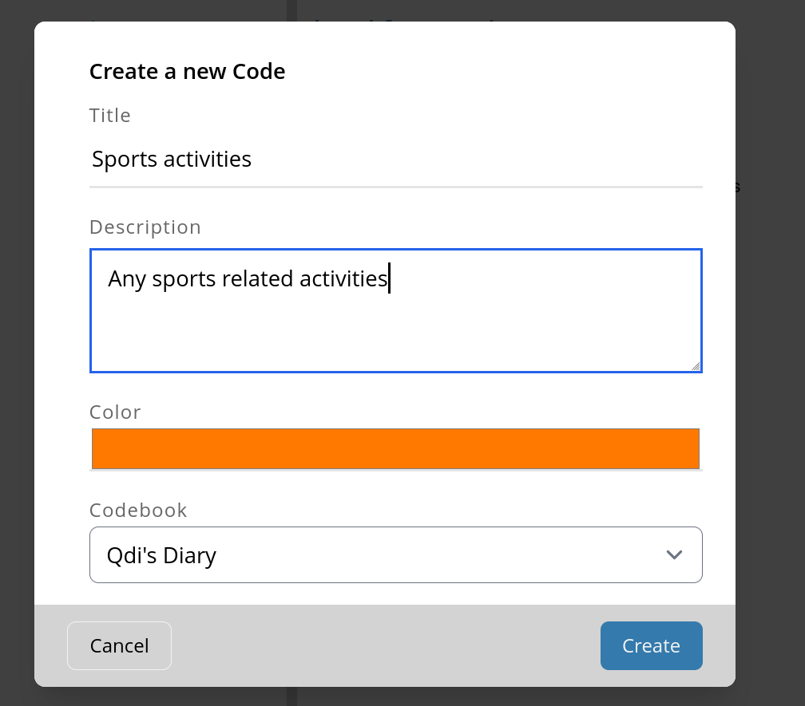
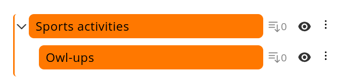
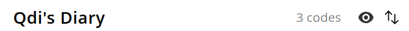
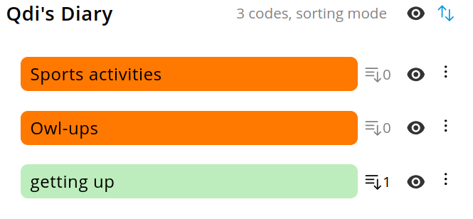
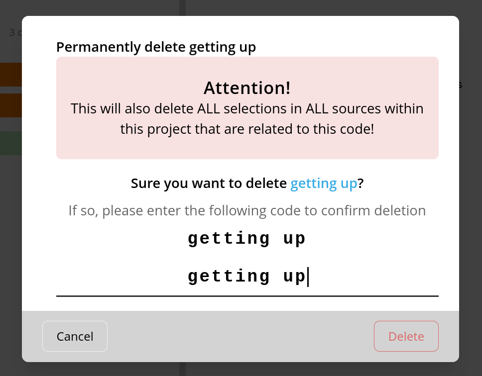

# Managing codes
Codes are an essential part of you QDA.
This page explains how you can manage your codes in OpenQDA.

## Create a new code
Keep in mind, that if you create a code, you will create it for a given
codebook and make it available for all sources of the current project.

Creating a code always requires a name, a related codebook and a color.
Optionally you can also define a parent code.

### Using the create form
Click on the "+ Create" button in the top left of the left panel in order to open
a new dialog with a form, asking you to fill in the required information about the code to create.

### Create in-vivo codes
The "+ Create" button will automatically change to "+ Create In-Vivo" if you select a range of text.
Click this type of button will invoke the create form prefilled with the selected text as name of the code.

Additionally, the selected range is automatically assigned the new created code.

### Create sub codes
You can create a new code as subcode (sometimes named child code) of an existing code.
To do so, open the menu of the code by clicking on the menu button (three vertical dots), 
positioned on the right side of the code and select "+ Add subcode".

This will open the create dialog with the given code preselected as parent and its color
preselected as the color for new subcode. The new created code is now indented and displayed as part of the parent code.

> [!NOTE]
> Don't worry if you accidentally created a code as child code or with a wrong parent.
> You can easily [change the sorting and the hierarchy](#sorting-codes-and-change-hierarchy) in order to fix this.

## Editing Codes
You can edit codes at any time. However, be aware the changes are applied across all sources
of the project. In order to edit a code, open the menu (three vertical dots) on the very right of 
the entry.

A menu appears with several options. Click on "Edit" to open the form dialog.
There you can adjust several properties, such as name, description, color or parent.

## Sorting codes and change hierarchy
In OpenQDA codes can be recursively hierarchical. 
This means a code can have zero, one or more subcodes, which in turn can have the same, and so on.
It also allows you to move codes across hierarchical levels. 

In order to activate sorting, click on the sorting button on the very right of the codebook entry.

The button will turn active and the label "sorting mode" will appear, indicating the sorting mode
being active.

Now you can now sort codes, simply via drag and drop.
Note, that moving a code will preserver it's children.
Don't forget to deactivate sorting after you are done.

↓

## Deleting codes

> [!CAUTION]
> Deleting a code will apply across all sources of the current project.
> If you remove a code then all selections for this code in all sources
> will be deleted, too.
> The action is highly destructive and we provide no way restoration. 
> Use with caution!

In order to delete a code you need to open its menu (three vertical dots) and select "Delete this code".
A dialog will appear, warning you about the consequences of this action.
You will have enter the exact name of the code (case and white space sensitive) in order
to activate the "Delete" button, which you have to click in order to confirm the deletion.

