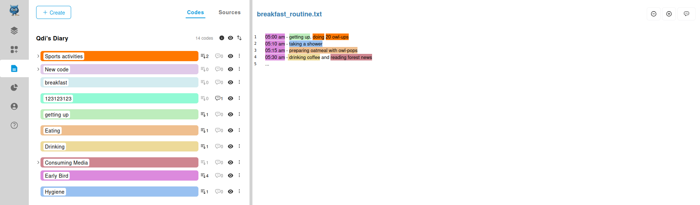
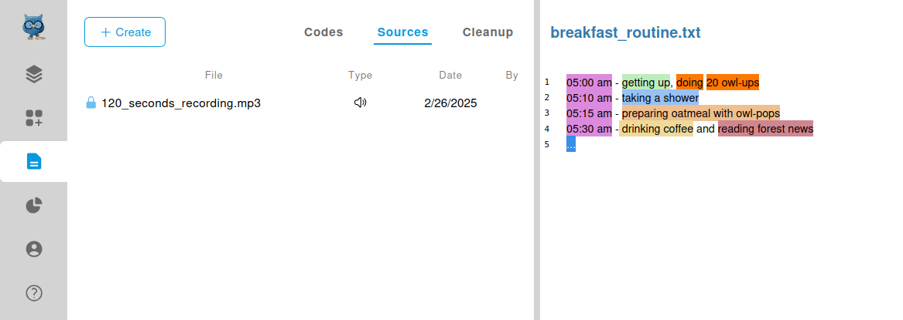
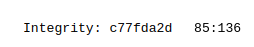

# Coding

You have finally arrived at the stage where you will do the actual coding.
Note, that OpenQDA refers to codes as reusable categories that you can assign to segments
of your sources. Such an assignment is named a "Selection".

If you come from other QDA software you might want to look at our [REFI-based temrinology](../../refi.md).

## Coding page
The coding takes place on the coding page, which you can reach by [selecting a project](../../projects/manage.md)
and then click on the coding icon on the left navigation bar.

### Left panel: code management
The main purpose of the left panel is to manage coding via the different tabs.
Here is a summary of what they have to offer:

#### 1. Codes Tab
Contains the [codes management](./codes.md), which is described on its own page
due to the amount of available features.
The currently opened source is obviously not included in that list.

#### 2. Sources Tab
The sources tab lists all **other** sources that are **locked for coding**,
so you can quickly switch between them during your coding workflow.

#### 3. Cleanup Tab
The "cleanup" tab, lists any selections, codes or codebooks, that might contain references that
lead to non-existing targets. You will likely never need this functionality unless you are actively informed about it
by OpenQDA.

### Right panel: selection management
The right panel focuses entirely on managing selection.
Assignments of codes to parts of sources is commonly referred to as coding. In OpenQDA, however these assignments
are not named "codes" but "selections".

#### 1. Selections
Although the editor might look like the same as [the editor from the preparations view](../preparation/editing.md),
it inhibits an entirely different functionality.
There is an [entire page on how selections work](./selections.md) and how you can interact with it. 

#### 2. Integrity and Position
Notice the bottom right: there is an 8-digit "integrity hash".
It is a shorted version of an [SHA-256 hash in hexadecimal form](https://en.wikipedia.org/wiki/SHA-2).

This hash value indicates the state of the source and might help you
to understand, if you still code the same version.
Furthermore, you might want to provide this hash to reviewers
or other coders to verify they code or review the same
source as you do/did.

Additionally, there are the start and end position of the current selection displayed,
indicating to which character range a coding will apply.
