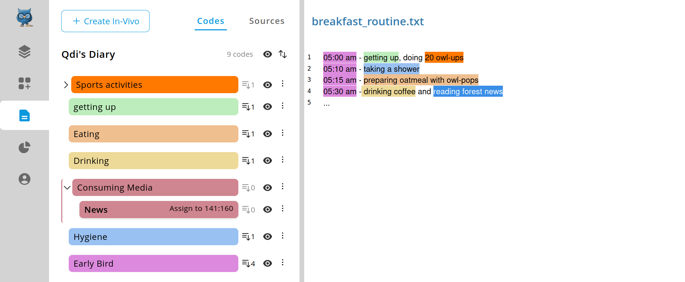
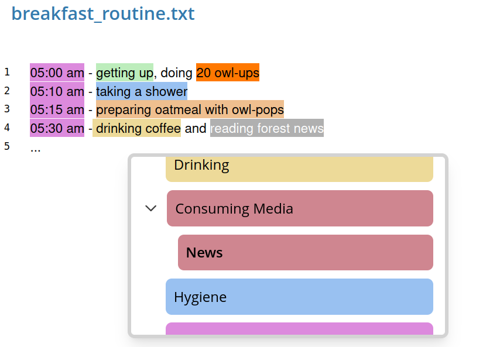
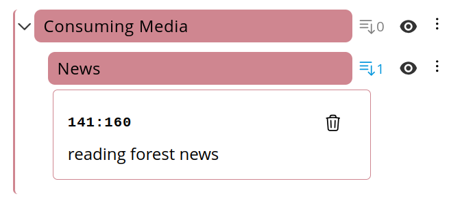
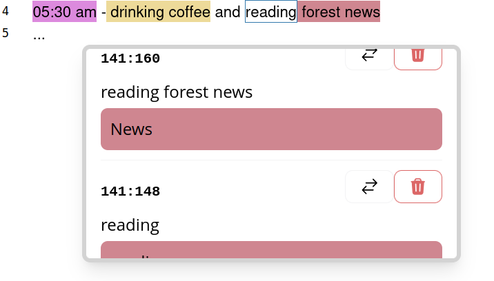
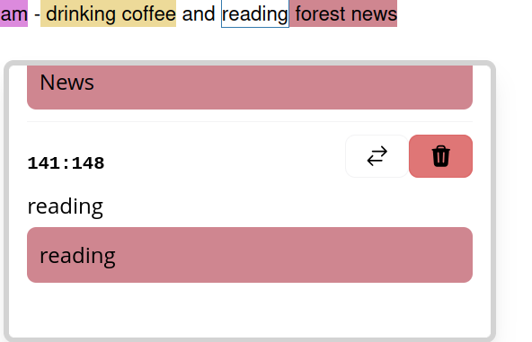

# Selections
Annotating your sources with codes results in a "section" (as defined by [REFI](../../refi.md)).
In text sources, selections are defined by a **range** (from start index to end index; indexes inclusive),
depicted by the pattern `<start index>:<end index>`.

Consider the following sentence:

```
The quick brown fox jumps over the lazy dog.
```

The sentence itself is 45 of length, starting at index 0 and ending at index 44.
If you'd select the word 'fox', the range would be defined as `16:19`, because it starts at index 16 
and spans over three characters, thus ending on index 19.

Note, we purposely [decided against lines](../preparation/editing.md#editor-lines) as measurement of 
selection positions.

## Why does the index starts at zero?
If you wonder why it starts at zero instead of one, there are two answers.

The simple answer: computers naturally count from 0, and it would be highly prone
to errors if OpenQDA would instead count from 1, because any operation on selections would
have to transform indexes by offset, before computing.

If you are even more curious about the reason, why computers start counting at zero, 
please read the [following answer](https://superuser.com/questions/578292/why-do-computers-count-from-zero)
and the [original paper](https://www.cs.utexas.edu/~EWD/ewd08xx/EWD831.PDF) 
by famous computer science pioneer Edsger W. Dijkstra.

## Assign codes
There are multiple ways to assign selections. The easiest one is to select a range (click and drag the mouse cursor)
of text and then click on the code you want to assign.



Another way is to select a range then open the selection menu by right-clicking on that selected range.
There you can also select the codes from the list by clicking on the intended one.



The selection is now colored with the color of the related code. You can hover your mouse cursor over the
text in order to reveal the range and related code's name.

Alternatively you can also right-click on the selection to reveal such information or execute
actions (assign another code to selection, delete selection).

In a [collaborative project](../../projects/teams.md) you will also see who assigned the selection.

> [!NOTE]
> For now there is full transparency for collaborative selections.
> In future releases we will provide multiple collaboration modes
> to support transparent coding, as well as independent coding (inter coder reliability).

Additionally, the selection is added to the code in the left panel's code list.
You can reveal it by clicking on the selections list button, right to the code entry.
This will collapse a panel, listing all selections related to the given code.



## Replacing a selection with a new code
If you right-click on a selection you will see the selection menu. 
There you are able to select a new code for the given selection.
Click on the button with the exchanging arrows to reveal the list of codes
and select a new code. The selection range will remain the same but the color
and related code will update to the new selected one.

## Overlapping selections

OpenQDA supports overlapping selections of arbitrary depth. In such case, the overlap will
not be assigned a color, but a white background with a border instead.
Hovering or right-clicking this range will reveal all involved selections, including their range
and related code.



## Deleting a selection
If you right-click on a selection you will see the selection menu.
There you are able to select a new code for the given selection.
Click on the button with the trash icon in order to delete the selection
for the given range.


> [!WARNING]
> You will not be asked to confirm the deletion.


