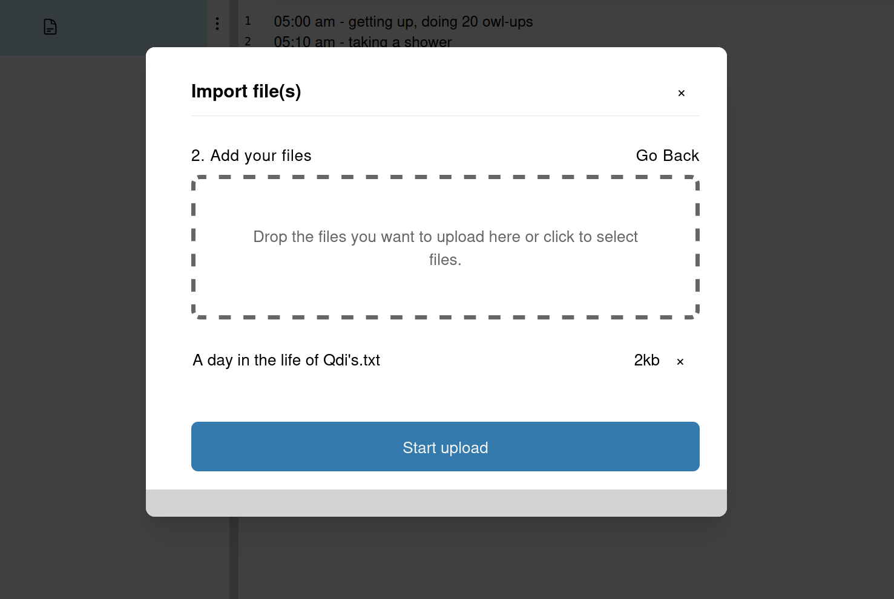

# Adding sources
OpenQDA provides you multiple ways to add sources to your project.

## Create a new Source
You can create a new empty (text-) source by clicking on the "+ Create" button on the left panel.
Then provide a name of the file and click "Create" to finish creation.

From there you can add your custom text (formatted or unformatted) using the editor on the right panel.

## Import sources
External data can become a source for your coding.
This part describes how to import them into OpenQDA.

### From file
OpenQDA provides an upload dialog where you can add multiple files in one step
and have OpenQDA upload them in a queue for you.

**Note, that we refer to "files" when they reside outside OpenQDA. Once imported,
we refer to them as "sources".**

#### Open Import Dialog
To do so, you first need to click on the "+ Import" in the left panel. Now you
should select "From my computer".

The import dialog will appear. From here you can select or remove files before finally invoking the upload.

#### Add files to upload
To add files, drag them from your file system into the dashed dropzone or click
on its text to open the classic file select dialog of your operating system.

> [!NOTE]
> Currently, this dialog only supports plain text files, RTF and audio files (which are transcribed to text).
> A future goal is to support most text-based formats.
> [You can help to add this feature by contributing to OpenQDA](https://github.com/openqda/openqda)

Once the files are selected you get a list if all files, prepared for upload:

At this stage you have multiple options for your next step:

- add more files → repeat the [last step](#add-files-to-upload)
- remove added files → click the little cross on the very right of the file's entry
- cancel the dialog → click the little cross in the top-right corner of the dialog; no upload will invoke
- start the upload → see the next step

#### Uploading files
Once you click "Start upload" the dialog will close and new sources are created immediately.
However, they will not be available right away. Each of them will go through a cycle of steps before
becoming available to further editing (see [the states section for icon meaning, state and description](./states.md))

The upload runs in the background, and you are free to navigate to other pages within OpenQDA.
You will receive a notification (in the top right corner), once a file is ready.

> [!WARNING]
> If you force-reload a page, all the files that remain to be uploaded will be gone.
> Files in converting state, though are expected to be available, once ready.
