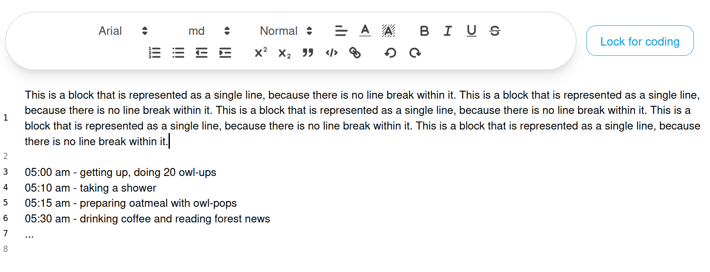
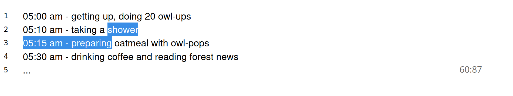

# Editing Sources
Once a source is ready and is not locked you are free to format it to your team's preferred
formatting rules.

> [!NOTE]
> For now there is no way to auto-enforce automated formatting rules.
> In the future, there might be plugins to implement similar features.
> [You can help to add this feature by contributing to OpenQDA](https://github.com/openqda/openqda)

## Editor lines
We actively decided against fixed line lengths or other line-based formatting, since
they are not universally experienced across devices and screen sizes.

Paragraphs without line breaks are considered a single line in OpenQDA.
Hence, you will see continuous text blocks associated with a single line number, while
others are associated "line by line".

## REFI Default
The REFI standard does only consider start position and end position as
standard-compliant fields for text selections.
We considered this as a strong indicator against a line-based representation.

## Selection ranges
We decided the range of selected characters as a reproducible way to determine
selections of codes across device types and screen sizes.

The range is represented in the format `<start index>:<end index>`, where start and 
end indexes are counted **inclusive**. In the preparation editor this is also supported 
for any of your selections when editing the source.

## Autosave
The editor automatically saves any significant change, such as changes in text, formatting and lines.
You will be notified about the auto save status in the lower right corner.

## Formatting options
We provide extensive formatting options for text-based sources, including sizing and coloring texts.
When importing formatted text (for example provided by RTF) then you can leverage them
in order to align the formatting with your project's overall formatting guidelines.
