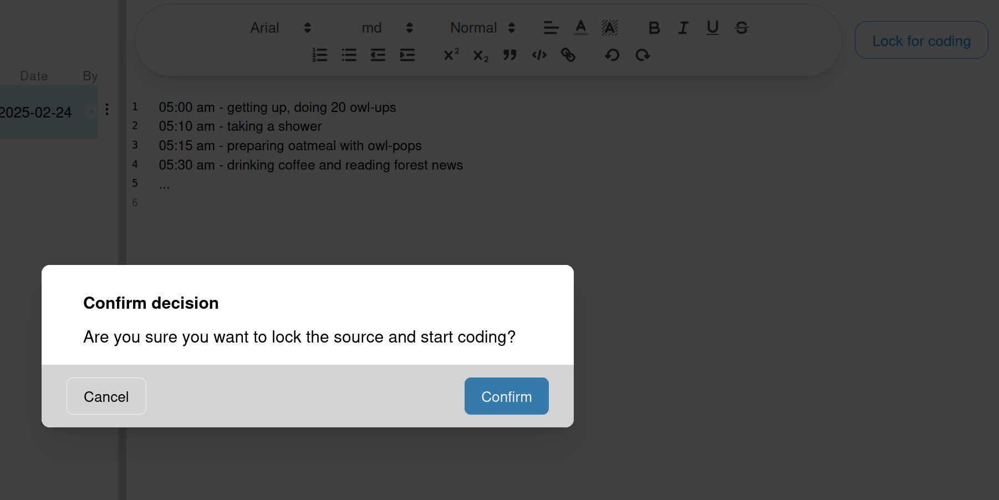

# Lock and Unlock Sources
In collaborative qualitative data analysis projects, it is essential to manage access to Sources effectively.
To prevent conflicts and ensure data integrity, OpenQDA provides a locking mechanism that allows users to lock Sources
for coding.

## Locking a Source
Once your source is ready for coding, you can click on the "Lock for coding" button,
located in the top-right of the right panel. It will open a dialog for you to confirm and
will then navigate you to the coding page.

> [!WARNING]
> Locked sources cannot be edited until they are unlocked.
> However, unlocking will currently result in selections being deleted,
> because all indexes would otherwise be broken.
>
> A future goal is to do proper offset computation in order to
> fluently switch between preparation and coding.
> [You can help to add this feature by contributing to OpenQDA](https://github.com/openqda/openqda)
> For now, please ensure that your source is finalized before locking it for coding.

## Why Lock Sources?
Consider user Alice and Bob working on the same project. They want to code the same source simultaneously.

If Bob makes changes to the source while Alice is coding, it could lead to inconsistencies and data loss
or corruption. By locking the source, Alice ensures that Bob cannot make any changes to it while she is coding and vice versa.