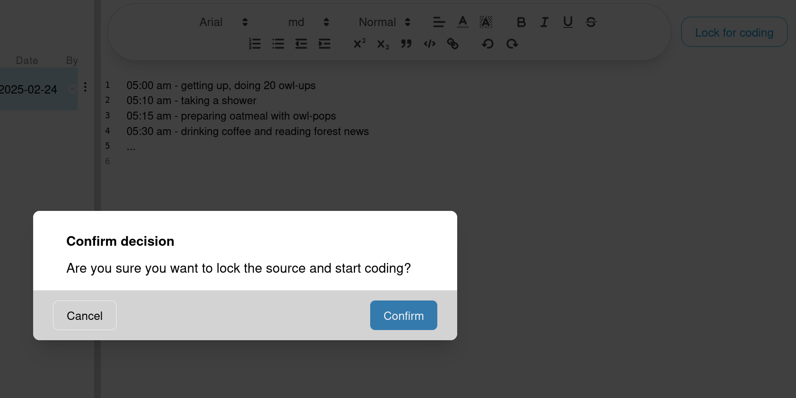

# Managing Sources
This page assumes, you have already added at least once source to your project.
If you haven't yet, then you should first [add a source](./add_sources.md).

Sources management relies on the [two panels](../../ui.md).
The left panel lists all sources, added to this project, as well as their [state](./states.md) and
the respective available actions.
The right panel will display the editor for the source's content, once a source
has been selected for editing.

## Reveal full name
Long source names are truncated by default.
If you hover a source's name, the current entry will reveal its full name.

## Open a Source in editor
Hovering a source, followed by clicking on its name
will load its content into the editor (right panel).

## Editing a source
See [editing sources](./editing.md).

## Lock for coding
Once your source is ready for coding, you can click on the "Lock for coding" button,
located in the top-right of the right panel. It will open a dialog for you to confirm and
will then navigate you to the coding page.

> [!NOTE]
> For now there is no way to switch between coding and source editing.
> Future versions might support this, though.

## Unlock

## Source actions
Every entry in the source list reveals an actions menu button (three vertical dots).
Clicking it will open a dropdown menu with various items, depending on the source's [state](./states.md).

### Download source file
This enables to download the source's **original file** for further external work.
The following actions are generally available:

### Rename
Allows you to change the displayed name of the source.

### Delete

> [!DANGER]
> This deletes a source, including all associated selections.
> Codes will not be deleted, as they exist independent of sources.
