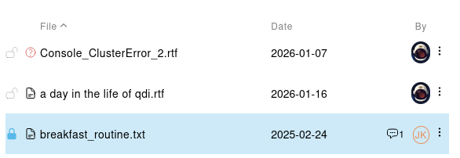
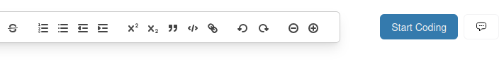
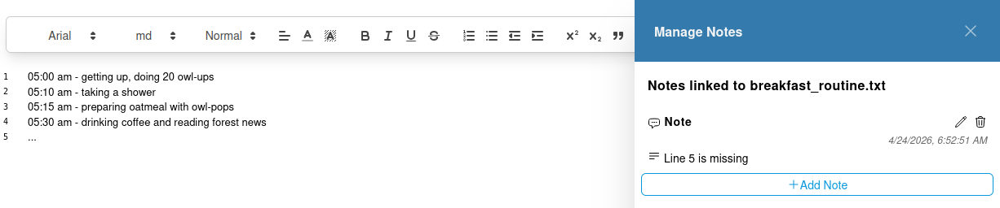
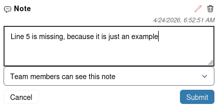
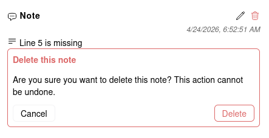

# Manage Notes for Sources

You can add Notes (also known as Memos) to your sources to keep track of important information about the source, 
such as its content, context, or any other relevant details.
Notes can also help you to communicate these details to your team members.

> [!NOTE]
> Notes on this page are only associated with the currently selected source.
> Select a different source to manage its Notes.
> If you need to manage Notes for Codes or Selections, you need to
> go to the [coding view](../coding/overview.md) and manage them there.

## Notes on the Source List

If a Source contains at least one note, it will be indicated by a small chat bubble icon in the file list.

## Open the Notes Panel

To manage Notes for the currently selected source, click on the Notes icon in the right panel in the upper right corner.

This will open the Notes panel, where you can add, edit, and delete notes for the selected source.

## Notes Panel Elements

You can find the following elements in the Notes panel:
- **Add Note Button**: Click this button to add a new note for the selected source.
- **Edit Notes Icon**: The pencil icon of an existing note allows you to edit the note's content.
- **Delete Notes Icon**: The trash icon of an existing note allows you to delete the note

## Add a Note

To add a new note, click on the "Add Note" button. 
This will open a simple form where you can enter the content of the note and optionally set the visibility of the note.
By default, the Note is private, and only you can see it.
If you want to share the note with your team members, you can set the visibility to "Team members can see this note".

## Delete a Note

To delete a note, click on the trash icon of the Note you want to delete.
This will open a confirmation dialog, asking you to confirm the deletion of the Note.

