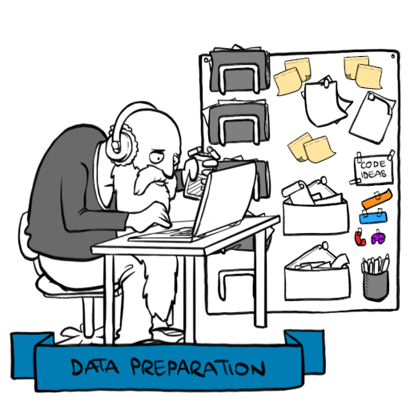
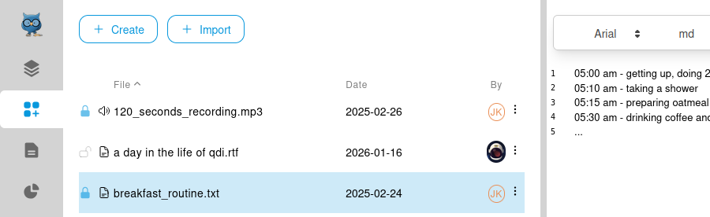

# Preparation

This part of the workflow deals with all the preparations of your Sources.
A source in [REFI](../../refi.md) can be any material that is subject to your coding and analysis,
ranging from text files to media, such as audio and video or custom complex formats.

## Preparation view
In order to prepare your data for coding you first need to select a project
and then navigate to the preparation page, by clicking the preparation icon
on the [navigation bar](../../ui.md):

## Sources
In OpenQDA your data is organized in Sources (a [REFI](../../refi.md) term).
Each source is associated with a specific major datatype, 
such as text, image, audio, video, mixed types and custom types.

> [!NOTE]
> For now OpenQDA supports only text-based Sources, as well as Audio, which is transcribed to text.
> Future releases may increase the set of supported source formats and mechanisms to add them.

